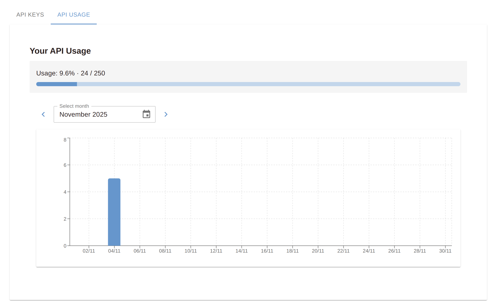

<p align="center">
  <br/>
    <a href="https://pdf-redaction.com/" target="_blank"></a>
  <br/>
</p>

<p align="center">
    <i>Secure Your PDFs with AI-powered Redaction</i>
</p>

<p align="center">
    <a target="_blank" href="https://colab.research.google.com/github/StabRise/pdf-redaction-api/blob/main/jupyter/PDF-Redaction-API.ipynb">
      
    </a>
    <a href="https://github.com/stabrise/spark-pdf/blob/main/LICENSE"></a>
    <a href="https://stabrise.com"></a>
  <a href="https://lightnow.ai/servers/com.pdf-redaction/pdf-redaction-mcp">
  
</a>
</p>

# PDF Redaction API

It is example of using API for [https://pdf-redaction.com](https://pdf-redaction.com)

Free API for redacting PDFs available at [https://api.pdf-redaction.com/api/docs](https://api.pdf-redaction.com/api/docs)

# Key Features

* Redact PDF using custom prompt
* Filter detected entities by type
* Support for multiple languages
* Support Digital and Scanned(image based) PDFs

# API Key

For generate API Key please go to the: [https://pdf-redaction.com/apikeys/](https://pdf-redaction.com/apikeys/)

For check usage: [https://pdf-redaction.com/apikeys/usage/](https://pdf-redaction.com/apikeys/usage/)



Put API Key to the env variable `PDF_REDACTION_API_KEY` or to `.env` file.

# Limitations

Limitations for free version:
* 10 page per request
* 100 Free requests per month
* 5 requests per minute

# 🚀 Instant Install self-hosted PDF Redaction API

 - Option A (curl): 
    ```bash
   /bin/bash -c "$(curl -fsSL https://raw.githubusercontent.com/StabRise/pdf-redaction-api/main/install.sh)"
    ```

 - Option B (wget): 
    ```bash
    /bin/bash -c "$(wget -qO- https://raw.githubusercontent.com/StabRise/pdf-redaction-api/main/install.sh)"
    ```
# Jupyter Notebooks with examples

| Chapter                                | Notebook                                                                                                                                                                                                          |
|----------------------------------------|-------------------------------------------------------------------------------------------------------------------------------------------------------------------------------------------------------------------|
| 1: PDF Redaction API                   | [](https://colab.research.google.com/github/StabRise/pdf-redaction-api/blob/main/jupyter/PDF-Redaction-API.ipynb)                       |
| 2: PDF Redaction API base64            | [](https://colab.research.google.com/github/StabRise/pdf-redaction-api/blob/main/jupyter/PDF-Redaction-API-base64.ipynb)                |
| 3: PDF Redaction API using prompt      | [](https://colab.research.google.com/github/StabRise/pdf-redaction-api/blob/main/jupyter/PDF-Redaction-API-base64-prompt.ipynb)         |
| 4: Redact QR Codes from PDF            | [](https://colab.research.google.com/github/StabRise/pdf-redaction-api/blob/main/jupyter/PDF-Redaction-API-base64-qrcode.ipynb)         |
| 5: Redact Rotated/Vertical text in PDF | [](https://colab.research.google.com/github/StabRise/pdf-redaction-api/blob/main/jupyter/PDF-Redaction-API-base64-rotated.ipynb)        |
| 6: Redact Signatures from PDF          | [](https://colab.research.google.com/github/StabRise/pdf-redaction-api/blob/main/jupyter/PDF-Redaction-API-base64-signature.ipynb)      |
| 7: Redact Faces from PDF               | [](https://colab.research.google.com/github/StabRise/pdf-redaction-api/blob/main/jupyter/PDF-Redaction-API-base64-face-redaction.ipynb) | 
| 8: Redact custom PII data              | [](https://colab.research.google.com/github/StabRise/pdf-redaction-api/blob/main/jupyter/PDF-Redaction-API-custom-tags.ipynb)                                                                                                                                                                                            |
| 9: Detect PII in PDF (no redaction)    | [](https://colab.research.google.com/github/StabRise/pdf-redaction-api/blob/main/jupyter/PDF-Redaction-API-detect-pii-pdf.ipynb)        |


# Redaction PDF using custom prompt

This provides the flexibility to redact PDF using custom prompt.

# Demo with web UI

You can try it out for free at [https://pdf-redaction.com](https://pdf-redaction.com)

[](https://pdf-redaction.com)

